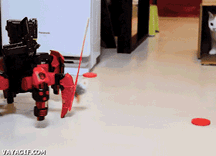
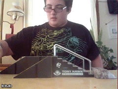

> **Nota:** Eu pensei muito antes de escrever esse artigo, sério! Não sou muito bom em passar sermão ou dicas por textos, mas vamos lá...

## Um assunto polêmico

Eu tenho um pouco mais de 6 anos de experiência em desenvolvimento web e posso falar que já vi de tudo um pouco nessa área, e esse artigo vai tratar de um assunto um pouco polêmico (como mamilos): _**O profissional deve saber de outras áreas que não são relacionadas a área dele?**_

> **Nota:** Porque eu me referi ao **profissional** e não ao **front-end** no texto acima? Por que, apesar do texto ser focado no mundo front-end, onde estou mais ligado, ele também vale para designers, programadores, marketeiros, UX e afins.

Durante minha trajetória até aqui eu já trabalhei com alguns programadores e designers que discordariam completamente da minha opinião, que é:

**_Sim, o profissional que trabalha com web deve saber, ou pelo menos entender das áreas a sua volta_**. Principamente as áreas nas quais sua equipe trabalha e as equipes que ele tem contato dentro da empresa onde trabalha.

Calma jovem, antes de você vir com pedras nas mãos eu vou começar a defender a minha opinião com os 6 itens logo abaixo.

## 1. Você raramente será passado para trás

Nessa área tem muito de, como dizia minha mãe: _"Tentar tapar o sol com a peneira!"_.

Sempre tem um que "acha" que o jeito dele desenvolver é o certo, mas tá longe de ser, tem aquele "espertalhão" que enrola por horas em uma tarefa que ele levaria alguns minutos, e por ai vai.

> Eu conheci programador que passava designers para trás em orçamentos só porque eles não tinham noção de quanto tempo ele levaria para desenvolver um sistema.

Entendendo como algumas coisas funcionam você pode cortar o barato desses fanfarrões :)

## 2. Entenda como está sendo feito

Não seja aquele programador que chega no horário, bate o ponto e cola o traseiro na cadeira o dia todo. De uma volta pela empresa, vá no departamento de marketing e assista um pouco do processo deles, pergunte como o designer chegou aquela ideia, acompanhe o UX no processo de planejamento do produto. Isso tudo pode trazer vários beneficios, agrega conhecimento a você e aos envolvidos.

> De uma volta pela empresa, vai te fazer bem!

## 3. Não feche os olhos para as novidades

Essa vai, com um carinho especial, para programadores back-end, aqueles programadores que ainda tem medo das tags HTML5 e das animações das CSS3.

Não seja esse cara. Entenda como as tecnologias novas podem ajudar em um projeto, como o HTML5 pode melhorar, e muito, o SEO de um website, como as animações das CSS3 podem, em alguns casos, até substituir o Javascript, não custa dar uma lida em artigos e tutoriais na internet.

## 4. Não tenha medo de aprender coisas novas

Um designer que aprende a programar não quer dizer que a empresa vai passar as tarefas do programador pra ele, quando ele estiver com o tempo livre, e assim vale para o programador ou para o front-end.

Aprender algo novo eleva muito o seu valor, como pessoa e como profissional, e isso ninguém tira de você.

Não tenha medo de saber como as coisas funcionam em outras áreas, aprenda de verdade, você vai se surpreender com quanta coisa legal tem por ai.

## 5. Não tenha medo que a empresa te explore por saber muitas coisas

Eu conversei com uma designer uma vez e ela mencionou aquelas empresas que abrem vagas para designers e exigem que o profissional saiba, HTML, CSS, JS, PHP, Java, Ruby, NodeJS, banco de dados, lavar, passar e cozinhar (mentira, nem é tudo isso eu exagerei um pouco).

Isso ainda existe e duvido que vá mudar, mas... quanto mais você souber maior o seu valor, concorda?

Geralmente, nas descrições das vagas, eles pedem um monte de coisas, mas muitas dessas coisas eles querem que o candidato saiba apenas o básico, apenas ter uma noção já basta. Não é que eles vão te contratar como front-end e vão te colocar como programador back-end, ou te contrata como designer e te colocar como desenvolvedor _full stack_.

## 6. E por último, não seja apenas um recortador de PSD!

Se você se titula por ai um **_Front-end engineer_** e não sabe se virar bem com alguma linguagem de programação, não sabe otimizar a performance de um site, ou não sabe usar o terminal a seu favor, sinto muito te dizer amigo, mas **_você é apenas um recortador de PSD_**.

Ser **_front-end_** vai muito além de apenas saber Javascript, você precisa cuidar do seu código, deixar seu JS performático e otimizar as variáveis.

Ser **_front-end_** vai muito além de apenas saber CSS, você precisa saber pré-processadores e usá-los da forma correta otimizando as suas CSS.

Saber HTML não basta para ser um bom **_front-end_**, você precisa entender, nas entrelinhas, o que cada tag tem pra te contar, ler o seu próprio HTML repetidas vezes a procura de uma imagem com um atributo `alt` vazio, saber pelo menos o básico de acessibilidade e de SEO é o mínimo para um bom **_front-end_**.

Saber usar pacotes como _gems_ e _npm_ para automatizar tarefas repetidas, saber usar git, criar e compartilhar coisas no github, tudo isso te faz um bom **_front-end_** e aumenta o seu valor como profissional.

Não deixe que digam que você é **_"apenas um fatiador de layout"_** e **_"diagramador de telas"_**, vá além do HTML, CSS e JS padrão de todos os sites, aprenda uma nova linguam de programação (recomendo ruby e python), tenha noção de design, cores e tipografia. Isso tudo vai te ajudar muito em sua carreira como **_Front-end_**.

## Conclusão

O mercado necessita de profissionais que interajam e aprendem sobre outras áreas, que não estejam relacionadas apenas com a sua formação. Se você não correr poderá ficar para trás.

Tem cada vez mais por ai, designers sabendo front-end, front-end sabendo UX e back-end tendo noções de design, não deixe que uma dessas pessoas tome sua vaga no mercado de trabalho.

/end.
