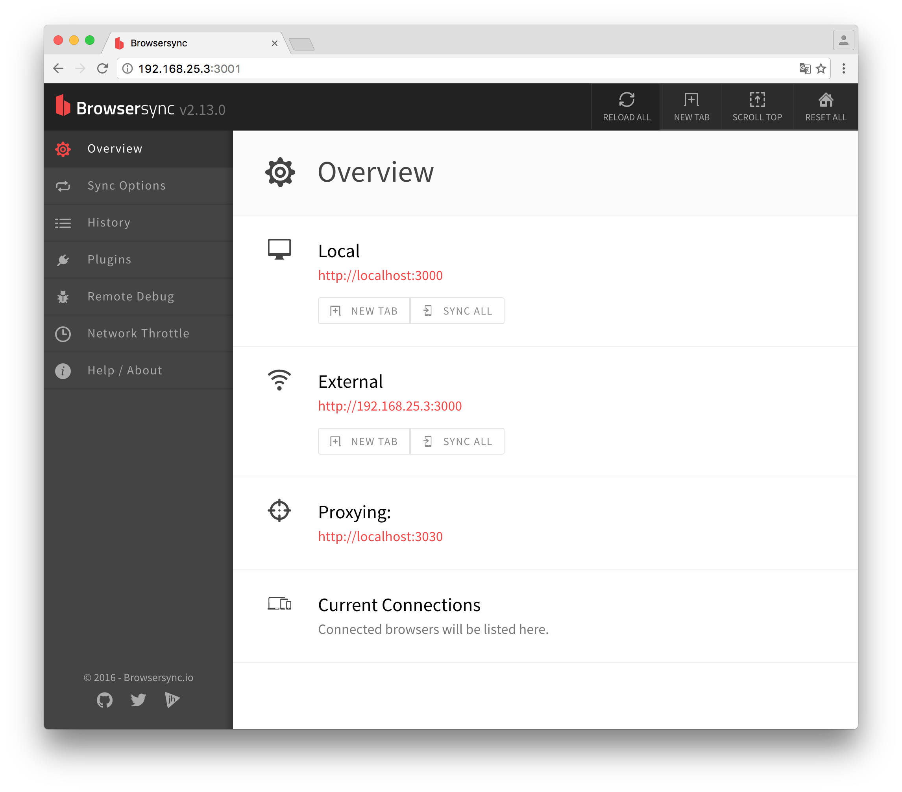

Aplicações Rails são magníficas não é mesmo? Todas aquelas Gems "mágicas", que fazem de tudo e um pouco mais, são lindas de se ver.

Mas e se eu quiser algo ainda mais "supimpa" pra fazer o meu _front-end_? E se eu não quiser sair do Rails? Será que existe algo que sincronize todos os navegadores possíveis ou que me de históricos e ferramentas para debug do _front-end_, será que existe uma Gem assim para Rails?

Eu procurei pelo Google a fora uma Gem que fizesse essa magia toda, mas não encontrei nada tão bom quanto o **[Browsersync](https://www.browsersync.io/)**, e se você não conhece o **Browsersync** recomendo dar uma lida [nesse artigo que a Caelum escreveu](http://blog.caelum.com.br/browser-sync-indispensavel-para-desenvolver-sites-em-varios-dispositivos/).

> ℹ️ Se você é _front-end_ e não conhece o **Browsersync** eu recomendo fortemente que leia sobre ele e comece imediatamente a usar, é uma ferramenta indispensável no cinto de utilidades do Batman!

### Ruby on Rails

O intuito desse post não é explicar sobre o Rails e suas ["Magic"](http://i.imgur.com/NpWtG3j.gif) Gems, e sim como integrar e usar o Browsersync dentro de uma app Rails.

Primeiro de tudo você precisa de uma aplicação Rails já instalada em sua máquina (a vá! jura? 😱), logo após essa façanha instale o Browsersync global (sim tem que ser global).

### Instalando o Browsersync

Para instalar o Browsersync global basta usar o comando abaixo.

```bash
$ npm install -g browsersync
```

Assim que a instalação estiver finalizada execute o seguinte comando para saber se tudo está funcionando.

```bash
$ browser-sync --version
```

O comando acima irá te mostrar qual a versão do Browsersync foi instalada na sua máquina, aqui instalou a versão `2.13.0`.

### Usando Browsersync dentro do Rails

Se você ainda não sabe o Rails sobe um servidor nativo com o comando `rails server` ou apenas `rails s` e usa a porta `3000`, então precisaremos do servidor do rails inicializado para rodar o Browsersync.

Após ter inicializado o server do Rails você precisa rodar outro comando no seu terminal (em outra aba ou em outra tela).

```bash
$ browser-sync start --proxy localhost:3000 --files "app/assets/**/* , app/views/**/*.html.*, \!tmp, \!log"
```

Eu vou explicar um pouco qual é a do comando acima. 😁

Basicamente eu estou inicializado o server do Browsersync, apontando para o proxy do Rails (que já está rodando na porta 3000), passando quais são os arquivos que eu quero que ele assista (no caso apenas os assets e as views do Rails) e por fim estou ignorando os arquivos temporários da aplicação.

Se isso tudo der certo ele vai abrir o navegador automaticamente para você, vai demorar um pouco até que ele sincronize tudo com o Rails, mas depois vai de boas.

Caso você não queira que o navegador abra automaticamente basta colocar `--no-open` no final do comando e sucesso.

Os comandos do Browsersync são bem fáceis de entender e se você já esta acostumado com outros comandos no terminal será bem tranquilo. Para saber mais leia em [browsersync.io/docs/command-line/](https://www.browsersync.io/docs/command-line)

---
Espero ter ajudado, Abraço!

😎
