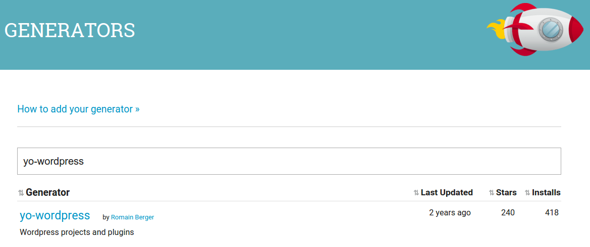
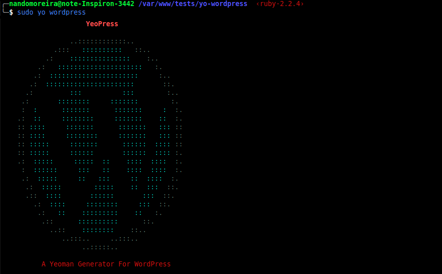
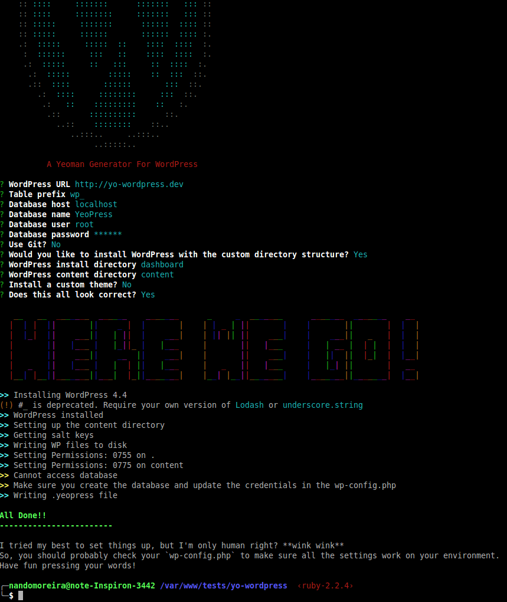
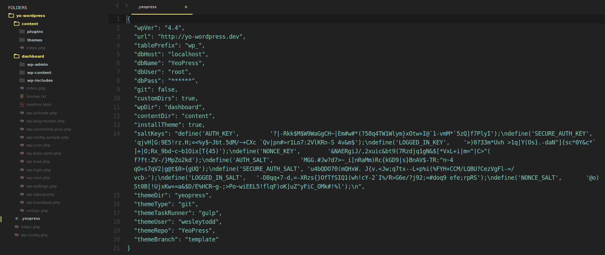

Esse é o meu primeiro artigo do ano de **2016**, então eu vou falar sobre **[Yeoman](http://yeoman.io/)** e o <abbr title="Content Management System">CMS</abbr> mais usado do mundo, o **[WordPress](https://wordpress.org/)**.

## O que é Yeoman?

> Yeoman helps you to kickstart new projects, prescribing best practices and tools to help you stay productive.
> <small>[yeoman.io](http://yeoman.io/)</small>

> _Traduzindo:_ Yeoman ajuda a iniciar novos projetos, a prescrição de melhores práticas e ferramentas para ajudá-lo a manter-se produtivo.
> <small>[Google translate](https://goo.gl/d9zH8D) :D</small>

E para isso existe os _Generators_, são basicamente pacotes <abbr title="node package manager">npm</abbr> feitos para Yeoman e que através deles você consegue dar o pontapé inicial de estruturas completas prontas para iniciar o seu projeto.

## O yo-wordpress

E sim, existe um _Generator_ para **WordPress**, o _YeoPress_ faz o download do WP e inicia uma estrutura complata pra você já sair codificando o seu projeto.

### Instalando o yo-wordpress

A instalação de um generator yo é bem simples, basta que você encontra o generator que deseja no [site do yeoman](http://yeoman.io/generators/) e siga as instruções de instalação do generator.

Nós vamos procurar por **yo-wordpress** no campo de busca e clicar no link.



Clicando no link você será direcionado para o [repositório do generator](https://github.com/romainberger/yeoman-wordpress), lá teremos o passo-a-passo de como instalar e usar.

Instalamos o Yeoman e o Generator como instalação de qualquer pacote <abbr title="node package manager">npm</abbr>.

```bash
sudo npm install -g yo generator-yo-wordpress
```

Com o comando acima instalamos o **Yeoman** e o **yo-wordpress**


## Gerando seu primeiro projeto com yo-wordpress

Após a instalação o seu generator poderá ser executado normalmente de qualquer diretório do seu sistema operacional. O comando para isso é simples também:

```bash
yo wordpress
```



Logo em seguida o generator irá pedir que você preencha alguns campos para que sua instalação sai bem. São elas:

- `WordPress URL`: URL de instalação do projeto;
- `Table prefix (wp_)`: O prefixo das tabelas que serão criadas no seu banco de dados, padrão é `wp_`;
- `Database host`: URL ou IP do seu servidor de hospedagem, padrão é `localhost`;
- `Database name`: Nome do banco de dados;
- `Database user`: Nome do usuário do banco de dados;
- `Database password`: Senha do usuário do banco de dados (claro que a minha senha não era **\*\***);
- `Use Git? (y/N)`: Você vai usar Git no seu projeto? A resposta precisa ser `Y` ou `N`;
- `Would you like to install WordPress with the custom directory structure? (Y/n)`: Gostaria de instalar o WordPress com a estrutura de diretório personalizado? A resposta precisa ser `Y` ou `N`. **OBS:** _Se caso a resposta da pergunta acima for `Y` o generator vai fazer mais duas perguntas logo abaixo._;
  - `WordPress install directory`: O diretório de instalação do core do WordPress, por exemplo eu coloquei `dashboard`;
  - `WordPress content directory`: O diretório onde ficarão o `wp-content` personalizado do seu projeto, por exemplo eu coloquei `content`;
- `Install a custom theme? (y/N)`: Deseja instalar um tema customizado? A resposta precisa ser `Y` ou `N` **OBS:** _Se caso a resposta da pergunta acima for `Y` o generator vai fazer mais seis perguntas._;
  - `Destination directory`: O nome do diretório que você deseja baixar o tema personalizado;
  - `Theme source type (git/tar)`: Deixe como `git` mesmo ;)
  - `Task runner (grunt/gulp)`: Qual Task runner você deseja no seu projeto? Eu selecionei `gulp`<3
  - `GitHub username`: Deixe como `wesleytodd`;
  - `GitHub repository name`: Deixe como `YeoPress`;
  - `Repository branch`: Deixe como `template`;
- `Does this all look correct? (Y/n)`: Responda `Y` e seja feliz :D



O Generator vai gerar todos os arquivos para o seu novo projeto, e também um arquivo `.json` chamado `.yeopress`, ele usa esse arquivo para armazenar as configurações que você preencheu ao rodar o comando no terminal, pra mim ficou assim:



## Conclusão

Usando generators você poupa um tempo massa de downloads, configurações, criação de diretórios, entre outros. E ainda se você trabalha criando novos projetos toda a semana com WordPress o ganho é absurdamente grande.

Você já usa o Yeoman no seu dia-a-dia? Você achou interessante essa abordagem? Comenta ai vai.

\end
